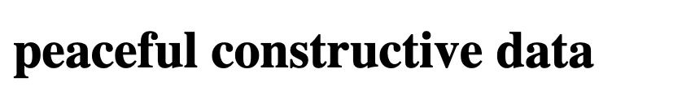

The Radical Data logo needed to express the possibilities for using data.

## Inspiration from BAK

I was inspired by the logo of BAK which is continually offering alternative options for its expansion.

Whilst BAK is an acronym for Basis voor Actuele Kunst (Centre for Contemporary Art), the logo allows for possibilities outside of that loaded phrase.

- Basis for activist knowing
- Basis voor actieve kennis (Centre for active knowledge)
- Basis for art and knowledge

By doing so, it is able to show the possibilities that exist for it as an organisation. It is not keen to pigeonhole itself into just one name.

## A Stochastic Approach

However, BAK used a single GIF that repeats in an expected way with only a few phrases. I was interested in expressing this same sense of possibility but in an exploratory, open-ended and stochastic way.

I used [P5.js](https://p5js.org/) to create a minimal example of achieving this goal. The *Minimal Word Changer* (improved name suggestions <u>more</u> than welcome) achieves this. The source code is available [here](https://github.com/joekroese/minimal-word-changer).

## How to find the words?

On planes and trains over several weeks I made notes of all the adjectives I thought that data *could* be and that I wanted to explore in this blog. Forgetful, fuzzy, communal, minimal, playful, transgressive, feminist...

## Bringing it together

The logo picks out two adjectives and sticks them together before the word 'data'. You end up with nice creations such as *curious anti-racist data*, *hopeful searching data*, even repeating adjectives *queer queer data*. Watching it, you are invited to think 'Ok, so what would that look like? How could I realise *reconciliatory, decolonial data*?'.

<Image src="radical-data-logo.gif" />

There are over 10,000 possible combinations, each one offering a new possibility of what radical data could mean. Hopefully, instilling an idea for a project or approach in the heads of the data scientists and artists and citizens reading this. Yep, I mean *you*.
