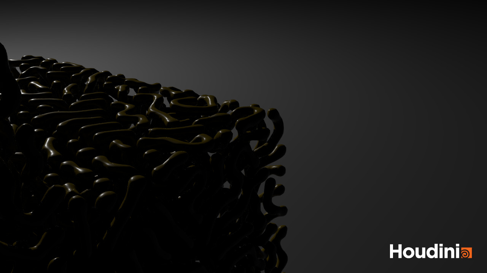
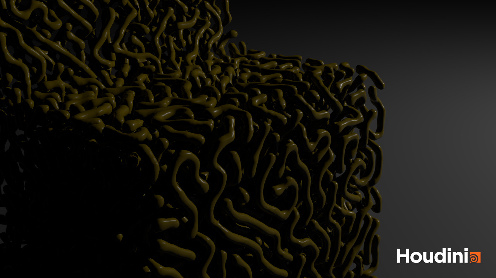
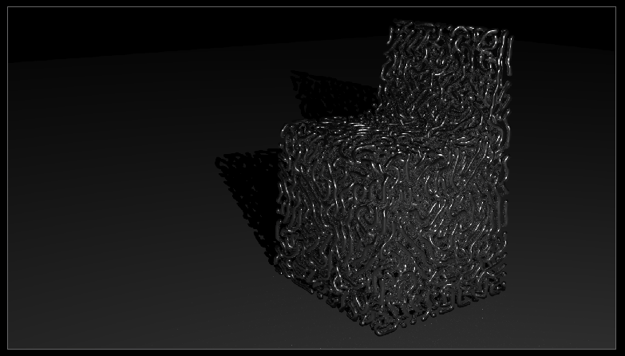

‘MfID’ imagines how computers may look to plants and humans for design inspiration when they are the only ones left.

By writing algorithms inspired by biological growth, MfID ‘grows’ chairs out of aluminium. The plant-like growth is then bounded by human design shapes: chairs, tables and teapots. The result is a hybrid of computer, human and plant design: computers growing plants inside human furniture.

The project seeks to explore how computers will build up their own cultural vocabulary after we are gone. Having a short history as a species, they will likely look at what came before them - humans, animals and plants - and play with those ideas.

The project is a collaboration with Peter Webster, an industrial designer in London. He has been responsible with providing the furniture models that the object grows into and are constrained by.

The following pictures show a chair I made. The growth algorithm used is inspired by a [reaction-diffusion algorithm](http://www.dna.caltech.edu/courses/cs191/paperscs191/turing.pdf) created by Alan Turing to describe the formation of patterns on animals.

